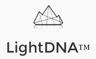

**LightDNA - ESP8266**
==========

This is the firmware of the light controller (ESP8266) for the LightDNA product that works with MQTT protocol.

**Features:**

 * Support specific and global MQTT topics
 * Receive retained information on topics of MQTT Broker
 * Comunicates on LDNA protocol with the MSP430 embedded into the light
 * Works with many versions of lights in the LightDNA portfolio


***Prerequire:***

- ESPTOOL.PY: https://github.com/themadinventor/esptool
- SDK 2.0 or higher: http://bbs.espressif.com/viewtopic.php?f=46&t=2451
- To compile you need to configure the **Makefile** that by default uses the below settings:

```bash
SDK_BASE	?= /opt/Espressif/ESP8266_NONOS_SDK
ESPTOOL		?= /opt/Espressif/esp-open-sdk/esptool/esptool.py
ESPPORT		?= /dev/ttyUSB0
```

**Compile:**
```bash
- make clean
- make all
- make flash
```

#Default configuration

SSID Wi-Fi: **LightDNA**

Pass WPA2: **lightdnaAWGEShda**

Broker Address: **192.168.0.100:1883**

#Revision

1.6 - Fixed bug for the null char on MQTT messages

**Authors:**
[Tuan PM](https://twitter.com/TuanPMT)
[Ânderson Ignacio da Silva](https://github.com/aignacio)


**LICENSE - "MIT License"**
